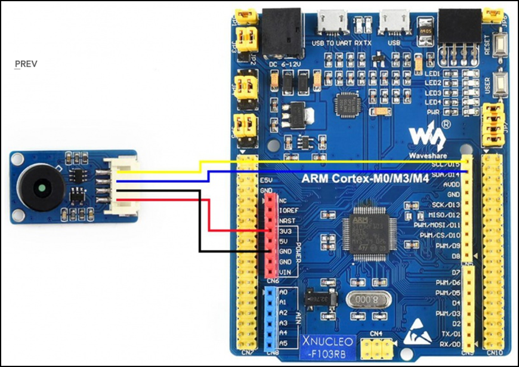
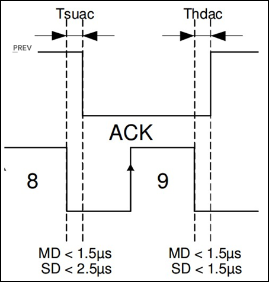
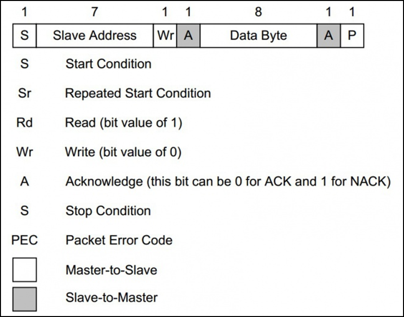
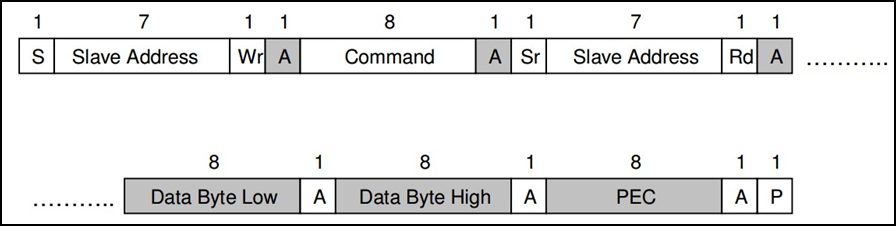
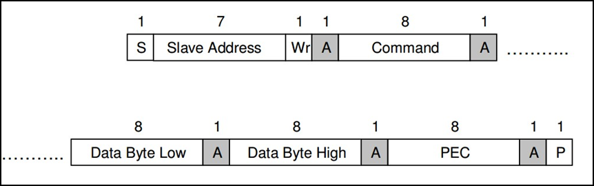
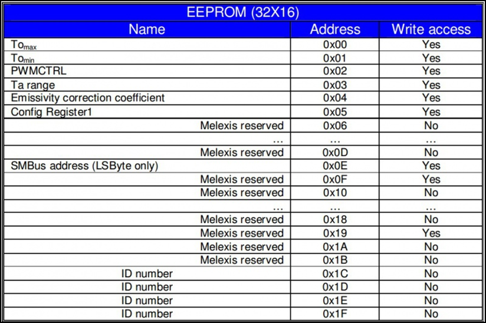
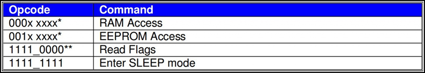
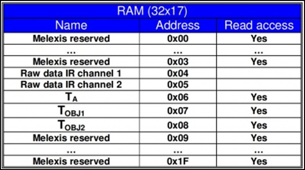
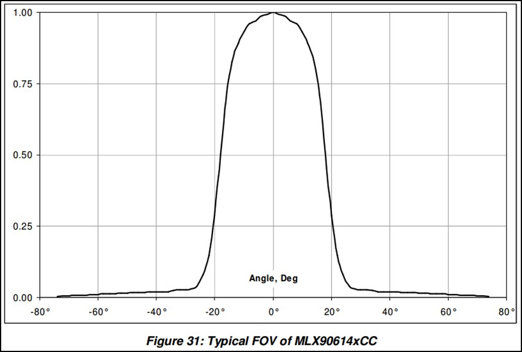
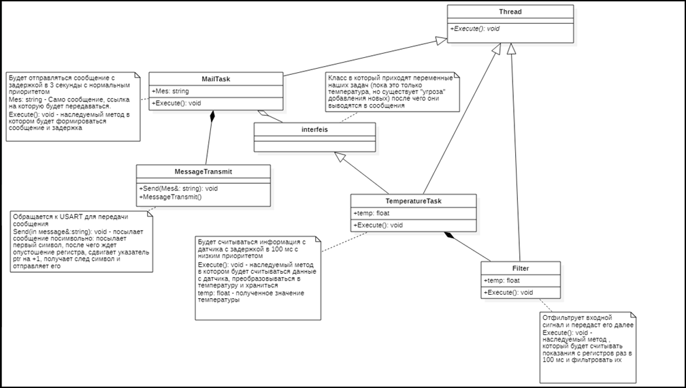

:toc:
:toc-title: ОГЛАВЛЕНИЕ:

== Задание
* Описание требований к курсовому проекту

== Инфракрасный датчик температуры

=== Характеристики
Мощность: 3,3 В ~ 5 В
Диапазон измерения (площадь): 40°C ~ 85°C
Диапазон измерения (объект): -70°C ~ 380°C
Разрешение: 0,02°C
Точность: ±0,5°C (0~50°C)
Поле зрения (FOV): 35°
Размер: 28 мм х 16 мм
Размер монтажных отверстий: 2,0 мм

=== РАСПИНОВКА
|====

|PIN |Описание
|VCC
|3,3 В/5 В
|GND
|Земля
|SDA
|Ввод данных I2C
|SCL
|Тактовый контакт I2C
|====

=== Протокол связи
Этот датчик имеет цифровой выход PWM и SMBus (шина управления системой). В этом документе мы вводим только связь SMBus. SMBus – это двухпроводной интерфейс, основанный на принципе I2C.
Стартовый сигнал: SCL имеет ВЫСОКИЙ уровень, SDA переключается с ВЫСОКОГО на НИЗКИЙ, начинается передача данных.

Сигнал остановки: SCL имеет высокий уровень, SDA переходит от низкого уровня к высокому, передача завершена.

image::image-2.png[]

ACK: Каждый раз, когда Master (Slave) получает 8-битные данные от Slave (Master), он отправляет ACK обратно отправителю, чтобы сообщить, что данные были успешно переданы, удерживая SDA неактивным в течение всего периода SCL.

Каждый раз, когда ведомое устройство (SD) получает каждые 8 бит данных, оно будет отвечать на ACK/NACK.

1. Ведущие устройства (MD) отправят адрес SD после инициализации связи. Только соответствующий SD, который может распознать адрес, подтвердит, остальные молчат.
2. Если SD не подтвердит адрес, MD прервет связь и снова отправит информацию.
Примечание. Результат расчета PEC основан на всех битах, кроме START, REPEATED START, STOP, ACK и NACK. PEC представляет собой полином (X8+X2+X1+1) от CRC-8. Каждый байт передается первым старшим битом.

=== Чтение времени SMBus

1. MD отправит сигнал Start, затем 8-битные данные на SD. Данные объединяются с 7-битным адресом SD и битом операции «Чтение». SD ответит на ACK после получения.
2. MD отправляет SD 8-битную команду, SD ответит ACK.
3. MD отправляет сигнал «Пуск» и 8-битные данные, которые снова объединяются с 7-битным адресом SD и битом операции «Чтение». SD ответит на ACK и отправит данные в своем регистре на MD после их получения.
Примечание. MD должен отправлять ACK каждый раз, когда получает байт. Если MD получает PEC, он посылает сигнал Stop для прекращения связи после ACK.

=== Время записи SMBus

1. MD отправляет сигнал «Пуск» и отправляет 8-битные данные, которые объединяются с 7-битным адресом SD и битом операции «Запись» в SD. SD ответит на сигнал ACK.
2. MD отправляет 8-битную команду на SD и получает ACK от SD.
3. MD сначала отправляет младшие байты данных, после получения ACK он отправляет старшие байты. Получите ACK, затем отправьте байты PEC.
4. В конце отправьте сигнал «Стоп», чтобы остановить связь.

=== Регистры ОЗУ MLX90614

=== Регистры EEPROM MLX90614

=== Команды MLX90614

Примечание*： xxxxx обозначает младшие 5 бит адреса регистров RAM/EEPROM, которые считываются и записываются.
Примечание**： Аналогично команде чтения. MLX90614 ответит на PEC после отправки 16-битных данных. Для MD необходимы только 4 бита PEC. MD прекратит связь после отправки последнего байта. Разница между чтением и чтением идентификатора заключается в том, что чтение идентификатора не повторяет стартовый бит.
Идентификатор чтения:

* Data[7] - EEBUSY – Операция чтения/записи в EEPROM продолжается, активен высокий уровень.
* Данные[6] – не используется
* Data[5] — EE_DEAD — в ЭСППЗУ возникает двойная ошибка. Активный Высокий
* Data[4] - INIT – POR инициализируется. Активный низкий уровень.
* Данные[3] – невыполнение.
* Данные[2..0] и Данные[8..15] – 0.

=== Анализ программы
Мастер пошлет стартовый сигнал в начале. Затем отправит 8-битные данные, которые объединяются с 7-битным адресом ведомого устройства и битом операции чтения/записи. Если имеется только один датчик MLX90614, 7-битный адрес по умолчанию равен 0x00. Если на шине более одного MLX90614, мы можем изменить адрес Slave в EEPROM. С сигналом Start, если мы хотим прочитать MLX90614, нам нужно отправить (SA<<1) + 0 = 0x00 далее. Если мы хотим записать, нам нужно отправить (SA<<1) + 1 = 0x01 дальше.

Согласно форме адреса регистра ОЗУ, адрес регистра температуры окружающей среды — 0x06, а адрес регистра температуры объекта — 0x07 в ОЗУ. С помощью формы команды мы можем узнать код операции доступа к ОЗУ 0x00 и 0x20 доступа к EEPROM. Как правило, мы считываем значение температуры из ОЗУ, нам не нужно читать EEPROM.

Чтобы получить доступ к регистру температуры окружающей среды в ОЗУ, введем команду: 0x00 | 0x06 = 0x06. И используем команду: 0x00 | 0x07 = 0x07 для доступа к регистру температуры объекта.Драйвер использует PB8 и PB9 для имитации синхронизации SMBus. Код драйвера находится в файле SMBus.c. Мы считываем данные о температуре окружающей среды и объекта в соответствии с приведенным выше временем, затем вычисляем температуру окружающей среды и температуру объекта в соответствии с таблицей данных.

Градус Цельсия（°C）： ((TempData_H <<8) + TempData_L )*0,02 – 273,15

=== Принцип измерения
Для бесконтактного инфракрасного модуля измерения температуры поле зрения (FOV) является очень важным понятием. FOV определяется 50% сигналом излучения, принимаемым термоэлектрической батареей. И это связано с осью шпинделя датчика. Обнаруженная температура представляет собой средневзвешенное значение температуры объекта, обнаруженной в FOV. Таким образом, значение является наиболее правильным, пока объект покрывает весь FOV.

Датчик этого модуля — MLX90614ESF-BCC, на рисунке выше показан показатель FOV BCC, FOV = 35°.
Это: Радиус измеряемого объекта ÷ Расстояние от зонда датчика = tan35 °, Это означает, что если радиус измеряемого объекта составляет 5 см, максимальное расстояние измерения составляет 7 см (убедитесь, что значение температуры является точным).

== Интерфейс USART2

=== Общее описание модуля

* Гибкая система установки скорости передачи.
* Программируемая длина слова (8 или 9 бит).
* Возможность конфигурации количества стоп битов (1 или 2).
* Контроль честности (четное количество 1 или нечетное).
* Конфигурируемый DMA для приема и передачи сообщений.
* 4 Флага дектора ошибок: (Overrun error, Noise detection, Frame error, Parity error).
* 10 флагов прерываний:
* Независимое включение передатчика и приемника.
** Transmit data register empty.
** Transmission complete.
** Receive data register full.
** Overrun error, Framing error, Noise error, Parity error.
** CTS changes, LIN break detection, Idle line received.
* Мульти процессорная коммуникация
* Поддержка LIN протокола, Поддержка ИК порта IrDA SIR(кодер и декодер), Поддержка SmartCard (возможность общения с SIM карта).

=== Особенности USART
UASRT STM микроконтроллера очень обширный, но мы рассмотрим только то, что относится к UART
В модуле USART можно настраивать следующие параметры:

* Скорость обмена до 4 мбит/c.
* Контроль четности.
* 1 или 2 стоповых битов.
* 8 или 9 бит данных.
* Запросы на детектирование ошибок приемо-передачи.
* Прерывания по приему, передачи, ошибкам передачи.
Для настройки и работы модуля UART нужны всего несколько регистров.

* USART_CR1/CR2/CR3 – регистр настройки 1.
* USART_DR – регистр принятого символа (регистр данных).
* USART_BRR – регистр настройки скорости передачи.
* USART_SR – регистр состояния.

=== Порядок запуска модуля USART
* Подключить USART к источнику тактирования – устанавливаем бит USART2EN в регистре APB1ENR (АЦП тактируется от матрицы шин APB1).
* Необходимо сконфигурировать порты. Настроить порты, на альтернативную функцию нужного модуля USART
* Настроить формат передачи байт, с помощью регистра CR1 и CR2
* Задать скорость передачи с помощью регистра BRR
* Разрешить передачу помощью бита TE и если надо прием, с помощью бита RE в модуле USART с помощью регистра CR1
* Включить сам модуль USART битом UE в регистре CR1
* Если работаем через прерывание, то разрешить глобальное прерывание для нужного USART, в регистре ISER[1] модуля NVIC
* Если работаем через прерывание, в зависимости от того, что нам нужно, разрешить прерывание по сигналу модуля UART (например, от сигнала регистр данных передачика пуст (бит TXEIE в регистре CR1))

== Операционная Система Реального Времени FreeRTOS
ОСРВ предназначены для обеспечения интерфейса к ресурсам критических по времени системах является своевременность (timeless) выполнения обработки данных.
Задачей ОСРВ является обеспечение реакции на определенное действие за отведенный квант времени. Для разных задач квант может иметь разное значение.
Время реакции системы на события - интервал времени от события на объекте и до выполнения первой инструкции в программе обработки этого события. Интервал времени определяется свойствами операционной системы и архитектурой микроконтроллера.
ОСРВ упрощают разработку той программы, где необходимо паралельно обрабатывать множество действий, в том числе можно без особого труда добавить дополнительные, что позволяет расширить программу, однако в слишком тривиальных задачах она лишь дополнительно усложнит задачу.
ОСРВ обеспечивает многозадачность (или псевдомногозадачность).
Существует 2 версии многозадачности:

1. "Мягкого" реального времени программа либо выполняется за определенное время либо нет.
2.	"Жесткого" реального времени - каждая задача должна выполняться за отведенный квант времени, невыполнение ведет к краху системы.
В ОСРВ используются задачи, которые вызываются планировщиком каждый раз по прерыванию системного таймера либо при непосредственном вызове планировщика.
Каждый раз планировщик пробегается по списку задач выбирает задачу готовую к работе.
В кооперативной многозадачности планировщик смотрит завершена ли текущая зада и готова ли задача с большим приоритетом. В вытесняющем режиме планировщик лишь смотрит готовую задачу в большим приоритетом и в случае чего прерывает менее приоритетную.
Один из таймеров микроконтроллера настраивают на генерацию системных "тиков" - вызовов прерывания таймера в котором вызывается планировщик.

Free RTOS – бесплатная многозадачная операционная система реального времени для встраиваемых систем. Планировщик системы простой, но при этом позволяет задать приоритеты процессов, вытесняющую и невытесняющую многозадачность, очереди.
Задача – это подпрогамма, которая имеет свою точку входа, и исполняется внутри бесконечного цикла, Имеет собственный приоритет, стек, идентификатор. Задача может находить в нескольких состояниях и переходить в одно из другого.

== Фильтр

Входной сигнал необходимо будет отфильтровать с помощью фильтра с бесконечно-импульсной характеристикой БИХ. На рисунке ниже представлены требования к нему.

image::image-2022-03-03-22-37-12-039.png[]

Время дискретизации фильтра совпадает с временем получения новых значений сигнала.

== Питание

Питание будет осуществляться с помощью солнечной батареи, поскольку питание будет нестабильно, необходимо будет уменьшить частоту процессора. Было выбрано питание от солнечной батареи, используя Solar Power Manager . Он может подавать напряжение от 6 В до 24 В.

== Архитектура программы (примерно)

